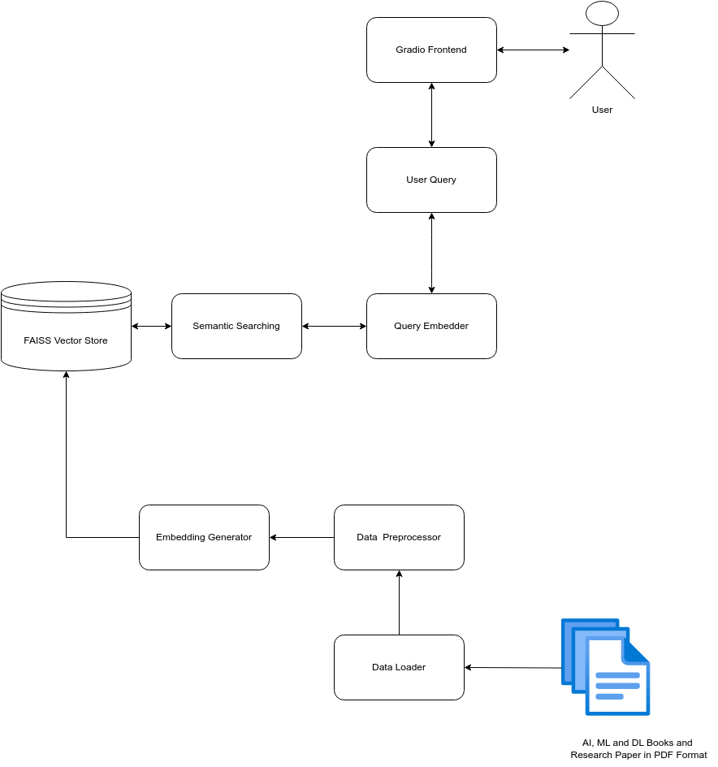

## 🧠 IntellectEngine - RAG Application

IntellectEngine is a **Retrieval-Augmented Generation (RAG)** application that combines vector search with LLMs to provide accurate, context-aware answers from a collection of machine learning and deep learning resources.

It uses **LangChain**, **FAISS**, and **Google Generative AI** for embeddings & retrieval, with a **Gradio-based interface** for user interaction.

---
  
*A conceptual overview of the IntellectEngine workflow.*
---

```
## 📂 Project Structure

```base
IntellectEngine/
│
├── 📁config
│   └── rag_config.json
│
├── 📁data
│   ├── 📁raw            # Raw PDF files
│   ├── 📁processed      # Preprocessed documents (chunks + metadata)
│   └── 📁faiss_index    # FAISS vectorstore
│
├── 📁logs               # Application logs
├── 📁src
│   ├── logger.py        # Logging utility
│   ├── data_loader.py   # Raw data handling
│   ├── preprocessor.py  # Document chunking/cleaning
│   ├── vectorstore.py   # FAISS vectorstore handling
│   ├── rag.py           # RAG pipeline
│   └── config.py        # Embedding model configuration
│
├── main.py              # Gradio interface (entry point)
├── requirements.txt     # Dependencies
└── README.md            # Project documentation

```

---

## ⚙️ Installation

1. **Clone the Repository**

    ```base
    git clone https://github.com/shanks1554/IntellectEngine.git
    cd IntellectEngine
    ```

2. **Create virtual environment**

    ```base
    python -m venv .venv
    source .venv/bin/activate   # On Windows: .venv\Scripts\activate
    ```

3. **Install Dependencies**

    ```base
    pip install -r requirements.txt
    ```

4. **Set environment variables**

    Create a .env file in the root directory and add you GEMINI API KEY:

    ```base
    GEMINI_API_KEY = your_api_key
    ```

---

## ▶️ Usage

Run the application

```base
python main.py
```

This will launch a Gradio web interface where you can enter queries.

---

## 🎯 Domain & Use Case <!-- ⬅️ NEW SECTION (insert after Usage) -->

IntellectEngine is designed as a knowledge assistant for Machine Learning and Deep Learning.

It is best suited for:

- Explaining ML/DL concepts (e.g., gradient descent, backpropagation, CNNs, transformers).

- Answering theory-based questions from textbooks, lecture notes, and research papers.

- Supporting learners and researchers with context-grounded, reliable answers.

The system ingests PDFs of ML/DL resources and builds a knowledge base, making it a specialized educational RAG assistant, not just a generic chatbot.

---

## 🔍 Features

- 📖 Load and preprocess raw PDFs into a knowledge base

- 🗂 Build / load FAISS vectorstore (skips recomputation if already exists)

- 🤖 Retrieval-Augmented Generation (RAG) pipeline

- 🎛 Gradio interface with submit button and loading screen

- 📜 Logging of system events and queries

---

## 🛠️ Tech Stack

- LangChain – Orchestration framework

- FAISS – Vector similarity search

- Google Generative AI (Gemini) – Embeddings + LLM

- Gradio – Frontend interface

- NLTK & SentenceTransformers – Text preprocessing & embeddings

- PyPDF – PDF text extraction

---
# 📊 Results

- Accuracy: Significantly reduced hallucinations compared to zero-shot Gemini responses.

- Efficiency: FAISS lookup time < 200 ms on 7,000+ chunks.

- Usability: Gradio interface allowed non-technical users to interact easily.

Sample Output:

**Query**
Explain supervised learning in simple terms.

**Answer**

Of course. Here is a simple explanation of supervised learning.

***

Think of supervised learning like teaching a student using flashcards.

On one side of the flashcard, you have a question or a problem (e.g., a picture of an animal). On the other side, you have the correct answer (e.g., the word "Dog").

In machine learning:
-   The "flashcards" are your **data**.
-   The "correct answers" are called **labels**.

The goal is to show the AI thousands of these labeled examples. By studying them, the AI learns the patterns and figures out the relationship between the question and the answer on its own. After enough training, you can show it a new flashcard it has never seen before, and it can predict the correct answer.

There are two main things you can do with this method:

1.  **Classification (Categorizing things):** This is for sorting items into groups. A perfect example is a spam filter. You train the AI by showing it thousands of emails that are already labeled as either "Spam" or "Not Spam." The AI learns what spam looks like. Then, when a new email arrives, it can accurately classify it.

2.  **Regression (Predicting a number):** This is for predicting a specific value. Imagine you want to predict a house's price. You would feed the AI data on many houses, including their features (square footage, number of bedrooms) and, most importantly, their *actual selling price* (the label). The AI learns how these features influence the price, so it can then predict a price for a new house.

In short, **supervised learning is all about learning from examples where you already know the right answer.** You act as a "supervisor" by providing the AI with a complete answer key to learn from.

---

## 📌 Future Improvements

- Add citations (show sources with answers)

- Multi-turn chat interface with memory

- Advanced UI (dark mode, sidebar for documents, etc.)

---
## 📜 License
This project is licensed under the MIT License – see the [LICENSE](./LICENSE) file for details.
